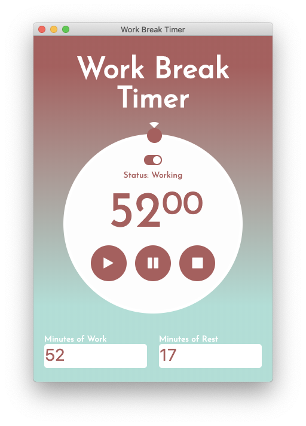

# 52/17 Work Break Timer

<!-- <div style="display: flex; justify-content: center;">
  <h2 style="font-size: 70px;">52/17 Work Break Timer</h2>
</div> -->

<div style="text-align: center;">
  <!-- <h3>View in Browser</h3> -->
  
</div>

### View in [Browser](https://livingkurt.github.io/Work-Break-Timer/)

# Inspiration

I always let time get away from me when working on a project. We all need to take regular breaks if where going to stay sharp and focused.
I learned of the 52 17 rule a long time ago. I would try to impliment it into my work routine, but there was no apps out there that really could do what I want without all the extra features that I dont want. I find it very helpful to set limits on the amount of time I work.

I used customized a work break timer from an activity in my bootcamp and turned it into an electron app to be used on my desktop

# Features

- Simple Design
- Ability to start and stop the timer if you need to
- Update Work and Break time to custom amounts
- Avaiable as a Desktop Application using Electron

# Installation

First clone this repo

```shell
git clone git@github.com:livingkurt/Work-Break-Timer.git
```

Install Dependancies

```shell
npm install
```

Run Electron App

```shell
npm start
```

# How it works

# Science

Link to [Source](https://www.themuse.com/advice/the-rule-of-52-and-17-its-random-but-it-ups-your-productivity)

Now I'm not a scientist, and I know that every person's attention span is different. But when I use this method of working and breaking, I really do notice a boost in my moral and productivity. "I could do anything for 52 minutes", is what I think whenever I start a work session. And right when you begin to lose focus and motivation, its time for a 17 min break. Which is just long enough to feel rejuvenating. But I will note, that your break must consist of something that is completely the opposite of what you are working on.

For example, if you are spending all day on a screen. Then you shouldn't sit on your phone looking through facebook during your break. Go outside, get some snacks. Do some push ups. Just do something that is the most unrealated to your task at hand.

# Technologies

- Javascript
- Node
- Electron
- SASS

Or if you can run it in the [Browser](https://livingkurt.github.io/Work-Break-Timer/)
